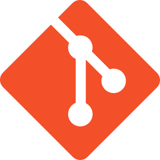
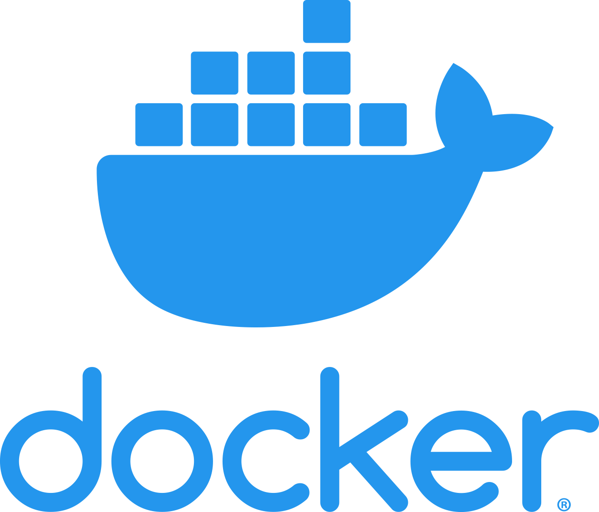
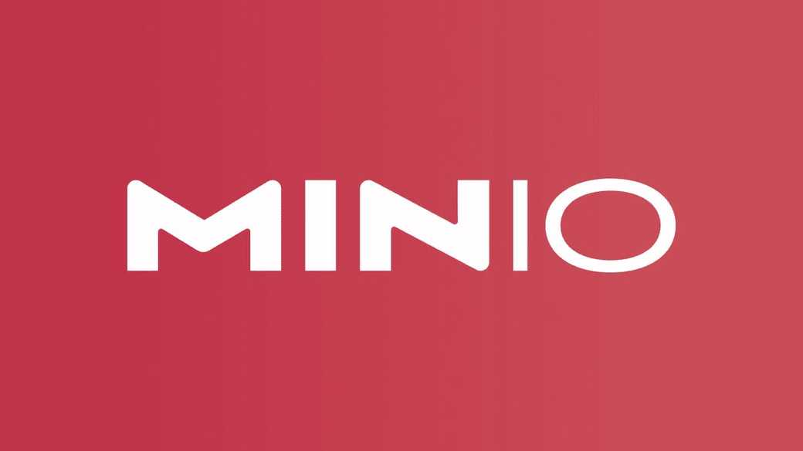

# Hi, I'm Sergio Sánchez Sánchez 👋🏽

👋 Hello, I'm an accomplished developer with over 8 years of experience, specializing in crafting exceptional mobile experiences 📱. As a seasoned Android developer, I've delivered a diverse portfolio of projects, demonstrating my commitment to building robust and user-friendly applications. Over the years, I've honed my skills to navigate the ever-evolving Android ecosystem, consistently pushing the boundaries of what's possible.

* **🌟 iOS Proficiency:** In addition to my Android expertise, I'm a skilled native iOS developer. My proficiency extends to both major mobile platforms, allowing me to create seamless user experiences across Android and iOS devices.
* **🚀 Venturing into Kotlin Multiplatform:** I'm also at the forefront of exploring Kotlin Multiplatform, an exciting cross-platform solution that promises cutting-edge mobility solutions. My journey into this technology is driven by a passion for pushing the boundaries of what's possible in the world of mobile development.
* **💼 Versatility:** My server-side expertise is equally impressive, with experience in PHP (Symfony, Laravel, Silex, Slim), Python (Django, Flask), and Node.js (Express, Nest.js). However, my true love lies within the Spring ecosystem and JavaEE or Jakarta EE. ☕
* **🏗️ Architect of Code:** Beyond coding, I'm an advocate for software architectures and clean code principles, firmly believing that well-structured code is the foundation of any great project. 🧹
* **🔒 Tech Enthusiast:** My enthusiasm for technology goes beyond app development. I have a profound interest in cybersecurity, IoT, and blockchain. My journey is marked by numerous educational achievements and certifications in these fields, uniquely equipping me to integrate these passions into my work. 🌐⛓️

Let's connect and dive deep into all things tech! 💻💬

## Profile Views

## :computer: Developer Skills

  
  
  
  
  
  
  
  
  
  
  
  

  
  
  
  
  
  
  
  
  
  
  
  

 
 
 
 
 
 
 
 
 
 
 

  
  
  
  
  
  
  

## 💳 Github Profile Summary Card
	

	

## 🏆 Trophy Stats
	

## :star2: StarDev, Stackoverflow and Medium profiles

## ⏱ Streak Stats
	

	
## 👨‍💻 Some Personal Projects 

### 🚀 QuickReels: A Fast-paced Multimedia Experience.

Take a look at the repository by <a target="_blank" href="https://github.com/sergio11/quick_reels_flutter">clicking here</a>

📱🎬 QuickReels is an innovative Flutter application that offers immersive multimedia experiences. Seamlessly integrating GetX and Firebase, it enables efficient state management, routing, and secure authentication.

* **🔄 Key Features:** GetX integration for efficient management, secure authentication via Firebase, focus on multimedia content, and scalable architecture.

* **🛠️ Technologies Used:** Flutter for UI, GetX for state management, and Firebase for authentication and data management.

✨ QuickReels delivers an intuitive interface to explore multimedia content, ensuring a dynamic and enriching user experience.

### 📸 PicConnect - Explore and Connect Through Photography 🌟.

Take a look at the repository by <a target="_blank" href="https://github.com/sergio11/pic_connect_app">clicking here</a>

PicConnect is not your ordinary social networking app; it's a vibrant community where you can share life's moments through captivating visual stories. 🌅🏞️🌄
Share your photos and videos, sprinkle creativity with tags and location data, and watch your moments come alive. 📷🎨📍

* **👍 Engage, Connect, Repeat 👍**: Connect with like-minded individuals who appreciate the art of visual storytelling. Get likes, comments, and shares as your moments light up PicConnect. 🤝💬🔄
* **🌟 More Than Socializing 🌟**: PicConnect is where moments become memories, and connections transcend screens. Whether it's a breathtaking sunset or an adrenaline-pumping adventure, your world awakens on PicConnect. 🌆🚀
* **📋 Discover More in Our README 📋**: Explore the comprehensive overview of PicConnect, including its features and the technology stack choices, in our README. 📄🔍

### 🎨 ArtNiche - Where Digital Art Meets NFT Collectibles

Welcome to ArtNiche, your gateway to a world of NFT art collectibles for digital artists. 🚀<a target="_blank" href="https://github.com/sergio11/art_niche_nft_marketplace">Click here to explore the repository!</a> 

Discover the extraordinary within the realm of digital art—exclusive creations by the industry's most sought-after creators. 💎 Dive into the Marketplace, where collectors unite to trade, and embark on your NFT journey by minting your own digital treasures, all within a single platform! 🖼️

ArtNiche is on a mission to break down barriers faced by content creators seeking to share their art directly with the public. 🌟 In today's digital landscape, owning an NFT is not just a trend; it's a status symbol and a genuine investment. 💰 Both collectors and buyers have found profitability in this ever-evolving space, making it an exciting venture for all. 🌐

### 🧒📱 Bullkeeper: Digital Parenting Reinvented 🚀

Take a look at the repository by <a target="_blank" href="https://github.com/sergio11/bullkeeper_app">clicking here</a>

Are you a concerned parent looking to safeguard your children's digital experiences? Enter Bullkeeper, your ultimate Android app companion designed with your kids' digital well-being in mind. 🛡️

👁️‍🗨️ The Mission: Bullkeeper is on a mission to create a safer digital ecosystem for children and adolescents. I am dedicated to identifying potentially harmful situations and fostering early detection of tech-related disorders that can result from inadequate or unreliable technology use. 🚫🌪️

🔒 Key Features:

* **🚨 Alert System:** Receive real-time alerts about potentially harmful content or interactions.
* **📊 Usage Insights:** Gain valuable insights into your child's digital habits.
* **🚷 Content Filters:** Set up filters to block inappropriate content and websites.
* **👥 Digital Wellness:** Promote healthy screen time management.
* **📥 Repository:** Explore the project's repository here to learn more.
   
Join us in the journey to ensure a safe, balanced, and responsible digital lifestyle for your loved ones with Bullkeeper. 🌟

### 📱 BullKeeper Kids Android App: A tool for children and adolescents to manage their digital time responsibly.

Empowering young digital explorers to balance fun and responsibility while adhering to parental controls. Enjoy a user-friendly setup, synchronized device resources, safety alerts, integrated messaging, and device usage control. 🎮👦👧💬🔒

* **🌟 Fun Time Management:** Encourages a balance between fun and responsibility in a safe and enjoyable digital adventure.
* **🔧 User-Friendly Assistant:** Easy setup with no technical expertise required.
* **👪 Child/Teen Account Integration:** Creates a secure and personalized digital environment.
* **🔄 Synchronized Device Resources:** Keeps you updated with notifications of any device changes.
* **🆘 Emergency Alerts and Safety:** Provides access to help and "pick me up" alerts directly from the app.
* **💬 Integrated Messaging System:** Fosters easy communication between children/adolescents and supervisors.
* **⏰🔒 Device Usage Control:** Monitors screen time and enforces parental control rules.

Take a look at the repository by <a target="_blank" href="https://github.com/sergio11/bullkeeper_kids_app">clicking here</a>

### A Spotify clone for Android
	
Take a look at the repository by <a target="_blank" href="https://github.com/sergio11/spotify-android">clicking here</a>

### Movie Addicts App (MVI + Clean architecture and modularization based on features and layers)

A simple project to demonstrate an approach based on MVI + Clean architecture and modularization based on features and layers.
	
Take a look at the repository by <a target="_blank" href="https://github.com/sergio11/MovieAddicts">clicking here</a>

### Rick And Morty Kotlin Multiplatform Mobile App

An App architecture example based on Kotlin Multiplatform Mobile.
	
Take a look at the repository by <a target="_blank" href="https://github.com/sergio11/RickAndMortyKMP">clicking here</a>

### 🌐📡 Unlocking IoT Potential with Apache Kafka and MQTT 🚀

The Internet of Things (IoT) has ignited a revolution, flooding the digital realm with a myriad of devices. From smart factories to bustling smart cities, we're generating colossal streams of time series data. 🏭🏙️

* **📊 The Challenge:** These data torrents are the heartbeat of real-time efficiency and failure prevention, presenting the challenge of processing terabytes of sensor data from diverse sources.
* **💪 The Solution:** Dive into this journey as I demonstrate how to conquer the time series data deluge. I harness the power of Apache Kafka and MQTT to tackle the high-performance requirements at scale. 🌊
* **🔌 Key Tools:** Explore the Kafka Connect APIs for seamless data ingestion and consolidation, and leverage the Kafka Streams API for efficient data aggregation and processing.

Ready to conquer the IoT wave? Explore the repository <a target="_blank" href="https://github.com/sergio11/iot_event_streaming_architecture">clicking here</a> for insights and solutions! 🌐🔍

### 🚀 Document Search Engine at Scale with Apache NiFi 📚

Embark on a journey to unlock the potential of a large-scale document search engine powered by Apache NiFi. This architectural proposal is designed to store and index vast volumes of files in diverse formats, enhancing advanced search capabilities and content organization.

📦 Key Features:

* **💡 Innovative Approach:** I present a visionary approach for efficiently managing and indexing content from a multitude of files, fostering advanced search functionalities and elevating content organization to new heights.
* **🛠️ The Power of Integration:** This project serves as a testament to Apache NiFi's immense capabilities, showcasing its seamless integration with other cutting-edge technologies such as MongoDB, Apache Kafka, HDFS, and more. It's a testament to the platform's adaptability and versatility in creating robust data solutions.

Explore the full potential of document search and data management by visiting the repository <a target="_blank" href="https://github.com/sergio11/document_search_engine_architecture"> here</a>. 🌐🔍

### 🏆🔐 Trust Certification System (TCS) - Revolutionizing Certificate Management with Blockchain Technology 🚀

Say goodbye to the hassle of paper trails and complex administrative processes when it comes to issuing academic or attendance certificates. 📜

📦 Key Features:

* **✨ Unique & Unforgeable Certificates:** TCS empowers you to create one-of-a-kind certificates that are immediately verifiable and tamper-proof, safeguarding all types of academic diplomas. 🎓🔍
* **🔗 Blockchain Magic:** The platform harnesses the incredible potential of blockchain technology to ensure the integrity and immutability of every certificate, offering an inviolable guarantee. 💎
* **🌐 Instant Verification:** TCS doesn't just stop at issuance; it also offers an easy verification process, granting students and certificate authorities the ability to provide digital, unforgeable certificates that can be validated by interested third parties. 🔒

Join us on this transformative journey towards digital trust and simplified certificate management. Explore the repository by <a target="_blank" href="https://github.com/sergio11/trust_certification_system_blockchain">clicking here</a> for a deep dive into the future of certification. 🏅🚀
	

