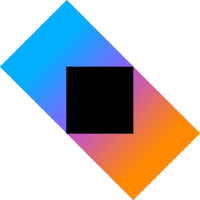
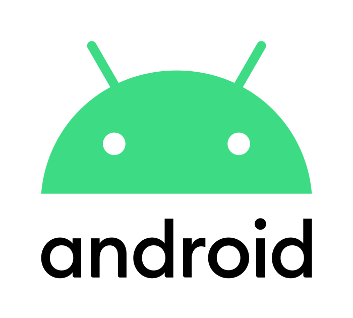
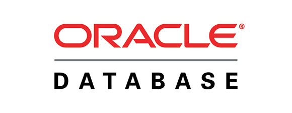

# Hi, I'm Sergio Sánchez Sánchez 👋🏽

👋 Hello, I'm an accomplished developer with over 10 years of experience, specializing in crafting exceptional mobile experiences 📱. As a seasoned Android developer, I've delivered a diverse portfolio of projects, demonstrating my commitment to building robust and user-friendly applications. Over the years, I've honed my skills to navigate the ever-evolving Android ecosystem, consistently pushing the boundaries of what's possible.

* **🌟 iOS Proficiency:** In addition to my Android expertise, I'm a skilled native iOS developer. My proficiency extends to both major mobile platforms, allowing me to create seamless user experiences across Android and iOS devices.
* **🚀 Venturing into Kotlin Multiplatform:** I'm also at the forefront of exploring Kotlin Multiplatform, an exciting cross-platform solution that promises cutting-edge mobility solutions. My journey into this technology is driven by a passion for pushing the boundaries of what's possible in the world of mobile development.
* **🤖 AI and LLM Expertise:** I have extensive knowledge in generative AI and Large Language Models (LLMs), continuously learning about Retrieval-Augmented Generation (RAG) techniques and agents. I am well-versed in orchestration frameworks such as LangChain and llamaIndex and work with LLMs like Llama3 and Mistral.
* **💼 Versatility:** My server-side expertise is equally impressive, with experience in PHP (Symfony, Laravel, Silex, Slim), Python (Django, Flask), and Node.js (Express, Nest.js). However, my true love lies within the Spring ecosystem and JavaEE or Jakarta EE. ☕
* **🏗️ Architect of Code:** Beyond coding, I'm an advocate for software architectures and clean code principles, firmly believing that well-structured code is the foundation of any great project. 🧹
* **🔒 Tech Enthusiast:** My enthusiasm for technology goes beyond app development. I have a profound interest in cybersecurity, IoT, and blockchain. My journey is marked by numerous educational achievements and certifications in these fields, uniquely equipping me to integrate these passions into my work. 🌐⛓️

Let's connect and dive deep into all things tech! 💻💬

## :computer: Developer Skills

  
  
  
  
  
  
  
  
  
  
  
  
  
  
  

  
  
  
  
  
  
  
  
  
  
  
  
  
  
  

 
 
 
 
 
 
 
 
 
 
 

  
  
  
  
  
  
  
  
  
  
  

## 💳 Github Profile Summary Card

 

  
  &nbsp;&nbsp;&nbsp;
  

	
## 🧩 Featured Projects

Take a look at some of the repositories that best represent my work, passion, and expertise across android development, backend systems, and AI innovation:

## ✍️ Recent Articles on Medium

I’m passionate about sharing my knowledge on the technologies I work with, ranging from mobile development (📱 Android & iOS) to cutting-edge fields like generative AI (🤖 LLMs), cybersecurity (🔒), and big data architectures (📊). I enjoy exploring how these areas intersect and how they can drive innovation in modern software development.

- **[Fine-Tuning Large Language Models (LLMs): Techniques and Best Practices for Different Use Cases](https://sanchezsanchezsergio418.medium.com/fine-tuning-large-language-models-llms-techniques-and-best-practices-for-different-use-cases-97fab572a7a9)**  
  A deep dive into LLM fine-tuning strategies, including supervised, RLHF, and task-specific tuning with hands-on examples.

- **[Mastering Jetpack Compose & Android TV Architecture: 5 Projects That Will Transform Your Development Skills in 2025](https://sanchezsanchezsergio418.medium.com/mastering-jetpack-compose-android-tv-architecture-5-projects-that-will-transform-your-5a791b790f07)**  
 A comprehensive guide to building production-ready Android TV apps using modern Compose and modular architecture.

- **[Harnessing Generative AI for Post-Exploitation Vulnerability Reporting in Cybersecurity: A Practical Case Study](https://sanchezsanchezsergio418.medium.com/harnessing-generative-ai-for-post-exploitation-vulnerability-reporting-in-cybersecurity-a-5ba3e53958ec)**  
  A case study on using generative AI for **data harvesting** from post-exploitation logs and automatically generating comprehensive, human-readable vulnerability reports. This approach aids in identifying potential system weaknesses, streamlining the process of fortifying systems against future attacks.

- **[Traffic Sentinel: IoT Solution for Intelligent Road Surveillance and Monitoring](https://medium.com/@sanchezsanchezsergio418/traffic-sentinel-iot-solution-for-intelligent-road-surveillance-and-monitoring-d002110d431e)**  
 A real-time FOG computing architecture for ingesting IP camera frames, processing them with Apache Flink and YOLO, and distributing results via Kafka. Designed for smart city surveillance, it balances edge inference with cloud analytics for efficient decision-making.

🔗 See all articles at [medium](https://sanchezsanchezsergio418.medium.com/)

## 👨‍💻 Projects I Built for Fun (and Learning)

Some of the best things I’ve built started as late-night experiments or weekend curiosities.

These personal projects reflect my passion for technology, my love for clean architecture, and my eagerness to explore new tools and paradigms. Whether it's crafting a sleek mobile app, testing out the latest in generative AI, or designing full-stack systems just for the challenge — I use these projects as a playground to grow as a developer.

I believe the best way to learn is by building.

### 🏡✨ Home Decor & Design Ideas with Roomify 🎨🌿

Roomify is your personal design companion — an innovative mobile app that makes transforming any space simple, inspiring, and fun! 💫

Just snap a photo of any room 📸, and Roomify instantly analyzes it to give you personalized design tips, curated color palettes 🎨, and décor suggestions that perfectly match your style and space. No more endless scrolling or guesswork — get professional ideas at your fingertips in seconds!

	
	&nbsp;&nbsp;&nbsp;
	
	&nbsp;&nbsp;&nbsp;
	

### Passionfy 💕✨ - Where Love Begins 🌟❤️

**Passionfy** is an iOS app I built to explore **SwiftUI** 🚀 and the art of crafting smooth, engaging user experiences. Designed to **bring people together** 🤝 by uncovering shared passions, it blends **elegance, functionality, and seamless animations** ✨.  

This project was a great way to dive into **modern UI design**, **interactive gestures**, and **real-time interactions**, all while creating something fun and meaningful! ❤️🌟  

	
	&nbsp;&nbsp;&nbsp;
	
	&nbsp;&nbsp;&nbsp;
	

### 🧵 Threads SwiftUI - Where Ideas Connect

**Threads SwiftUI** is an iOS 17 app I built as a personal project to explore **SwiftUI** 🚀 and **modern app architecture** 🏗️. Designed for sharing thoughts and discussing trending topics, it lets users **create threads**, **follow others**, and **like posts** ❤️.  

With **Firebase integration** 🔥 for authentication, storage, and real-time updates, it delivers a **smooth and secure experience** 🔐. This project was a great way to dive deeper into **SwiftUI animations**, **data management**, and building interactive social features. 🎨💬  

Take a look at the repository by <a target="_blank" href="https://github.com/sergio11/threads_swiftui">clicking here</a>

	
	&nbsp;&nbsp;&nbsp;
	
	&nbsp;&nbsp;&nbsp;
	

### NimbusTV 📺🌐 – A Personal Learning Project for Android TV Development

**NimbusTV** is a personal project built to explore **streaming** 🎶 and **EPG integration** 📅 on **Android TV** 📺.

It leverages **open playlists from the [iptv-org/iptv](https://github.com/iptv-org/iptv)** project, which provides thousands of free and publicly available **TV channels**, **radio stations** 📻, and **program guides**.

🎯 Key learning goals:  
- Parsing and managing **streams**
- Integrating  **EPG data**  
- Optimizing UI/UX for big screens using **Jetpack Compose for TV** 🎨 

With customizable reminders ⏰ and an intuitive interface, **NimbusTV** helps you enjoy your favorite content effortlessly.

	
   	&nbsp;&nbsp;&nbsp;
   	
   	&nbsp;&nbsp;&nbsp;	

### MelodiqTV 🎶✨: Unleash the Power of Music on Your TV 

**MelodiqTV** 🎶 is a personal project I created to explore **Android TV development** 📺, **real-time data with Firebase** 🔥, and **Jetpack Compose for TV** 🎨. It’s a simple yet functional **music and video streaming app**, designed with **Clean Architecture** 🏛️ and the **MVI pattern** 🔄 to provide a smooth, immersive experience on large screens.  

This project was a great opportunity to experiment with **UI design for TVs**, ensuring seamless playback 🎥 and intuitive navigation 🎮. 🚀  

Take a look at the repository by <a target="_blank" href="https://github.com/sergio11/melodiqtv_android">clicking here</a>

	
   	&nbsp;&nbsp;&nbsp;
   	
   	&nbsp;&nbsp;&nbsp;	

### SaboryTV 🍳📺: Your Personal Chef, Right on Your TV

**SaboryTV** is a personal project I built to experiment with **Android TV development**, **Firebase integration**, and **Jetpack Compose for TV**. It’s a simple yet functional cooking and recipe streaming app, designed with **Clean Architecture** and the **MVI pattern** to ensure a smooth and modern user experience.  

This project was a fun way to explore how to bring interactive content to larger screens while keeping the interface intuitive and engaging. 🚀  

Take a look at the repository by <a target="_blank" href="https://github.com/sergio11/saborytv_android">clicking here</a>

	
   	&nbsp;&nbsp;&nbsp;
   	
   	&nbsp;&nbsp;&nbsp;	

### Inquize - Capture Curiosity. Unlock Knowledge. 🔍📚💡

**Inquize** is a personal project where I explored the integration of AI-powered image recognition using the **Gemini SDK**. The app allows users to ask questions about objects, places, or concepts captured by their camera, providing real-time answers and transforming curiosity into a learning experience.  

This project was a great opportunity to experiment with **AI integration**, **real-time data processing**, and **interactive mobile experiences**.  

	
	&nbsp;&nbsp;&nbsp;	
	
	&nbsp;&nbsp;&nbsp;	
	

### FitFlexTV: A Personal Learning Journey in Fitness App Development 🏡💪

**FitFlexTV** is a personal project I developed to enhance my Android development skills, particularly in learning and implementing **Clean Architecture** and **MVI** patterns 🏛️. The app provides personalized home workout plans 🏋️‍♀️ and progress tracking, designed to support users on their fitness journey.

This project was built using **Jetpack Compose for TV** 📺, Firebase 🔥 for real-time data and authentication, and follows modern development best practices to ensure a smooth and scalable user experience.

My main goal with **FitFlexTV** was to improve my understanding of Android app architecture, while also experimenting with different design patterns to build a solid, maintainable app. By focusing on architecture, I aimed to improve the quality and sustainability of my development process.

Take a look at the repository by <a target="_blank" href="https://github.com/sergio11/fitflextv_android">clicking here</a>

	
   	&nbsp;&nbsp;&nbsp;
   	
   	&nbsp;&nbsp;&nbsp;	

### 🔒 VaultKeeper: Elevating Your Digital Security for Passwords and Banking Cards 💳

VaultKeeper: Securely manage your passwords and banking cards 🔐💳 in an encrypted vault using the latest Android technologies like Jetpack Compose 🚀. Elevate your digital security with robust encryption and modern design practices 🛡️📱.

	
	&nbsp;&nbsp;&nbsp;
	
	&nbsp;&nbsp;&nbsp;
	

### 🌟 RealInsight – Where Authentic Connections Happen 🌐

**RealInsight** is a personal project I created as an **iOS application** built with **SwiftUI**. It’s designed to offer functionality similar to BeReal, giving users a platform to connect, share insights, thoughts, and experiences in a supportive community. 📱💬🌟

This project allowed me to dive deeper into **iOS development**, focusing on creating an **authentic user experience** and exploring **SwiftUI** for dynamic interfaces. It’s a reflection of my commitment to building **real connections** through **technology**! 🚀

	
	&nbsp;&nbsp;&nbsp;
	
	&nbsp;&nbsp;&nbsp;
	

### TvNexa - My Personal Streaming Project 🌐📺

**TVNexa** is a personal project built to strengthen my skills in **Android TV development** 📺 using **Clean Architecture** 🏛️, **MVI pattern** 🔄, **Jetpack Compose** 🖥️, and **Material Design** 🎨.

It offers a simple, well-structured way to stream **international TV channels**, powered by the open-source playlists from **[iptv-org/iptv](https://github.com/iptv-org/iptv)** — a rich, community-curated source of free and public streams from around the world 🌍.

🎯 Key learning goals:  
- Applying **Clean Architecture** principles for modular, testable code  
- Implementing **MVI** for robust state management  
- Creating responsive, modern UIs with **Jetpack Compose for TV**  

	
	&nbsp;&nbsp;&nbsp;
	
	&nbsp;&nbsp;&nbsp;

### 🚀 QuickReels: A Fast-paced Multimedia Experience.

Take a look at the repository by <a target="_blank" href="https://github.com/sergio11/quick_reels_flutter">clicking here</a>

**QuickReels** is a personal project I built using **Flutter**, designed to offer an immersive and dynamic multimedia experience. 🎬📱 By integrating **GetX** for efficient state management and **Firebase** for secure authentication, it provides a seamless user experience and a scalable architecture for future growth.

* **🔄 Key Features:** GetX integration for efficient state management, Firebase-powered secure authentication, and a focus on delivering multimedia content.
  
* **🛠️ Technologies Used:** Flutter for building the UI, GetX for state management, and Firebase for authentication and data management.

✨ This app was a great opportunity to explore and strengthen my knowledge of **Flutter** and **Firebase**, while crafting a smooth, engaging platform to enjoy multimedia content.

	
	&nbsp;&nbsp;&nbsp;
	
	&nbsp;&nbsp;&nbsp;
	

### 📸 PicConnect - Explore and Connect Through Photography 🌟.

Take a look at the repository by <a target="_blank" href="https://github.com/sergio11/pic_connect_app">clicking here</a>

**PicConnect** is a personal project designed to bring people together through the power of visual storytelling. 🌅📷🌍 It allows users to share photos and videos, enhancing their moments with creativity through tags, locations, and more. Whether it’s a breathtaking sunset or an exciting adventure, PicConnect transforms everyday experiences into something memorable.

* **👍 Engage, Connect, Repeat 👍**: Build connections with like-minded individuals who share a passion for photography and creativity. Get likes, comments, and shares as your moments come to life.
  
* **🌟 More Than Socializing 🌟**: PicConnect goes beyond social interaction—it's about celebrating moments, forming meaningful connections, and sharing stories that resonate.

* **📋 Discover More in Our README 📋**: For a deeper look at the app’s features, tech stack, and design choices, check out the README on the repository.

This project allowed me to experiment with social networking features and integrate a variety of tools to create a seamless, engaging experience for users who love photography and connection.

	
	&nbsp;&nbsp;&nbsp;
	
	&nbsp;&nbsp;&nbsp;
	

### 🎨 ArtNiche - Where Digital Art Meets NFT Collectibles

Welcome to ArtNiche, your gateway to a world of NFT art collectibles for digital artists. 🚀<a target="_blank" href="https://github.com/sergio11/art_niche_nft_marketplace">Click here to explore the repository!</a> 

**ArtNiche** is a personal project designed to bridge the gap between digital artists and NFT collectors. 🚀 It offers a platform where creators can showcase and mint their digital art as exclusive NFTs, allowing collectors to discover, buy, and trade unique pieces in the growing world of digital art. 🖼️💎

This project allowed me to explore the world of NFTs and the integration of blockchain technology within a creative digital art platform.

	
	&nbsp;&nbsp;&nbsp;
	
	&nbsp;&nbsp;&nbsp;
	

### A Spotify clone for Android
	
Take a look at the repository by <a target="_blank" href="https://github.com/sergio11/spotify-android">clicking here</a>

	
	&nbsp;&nbsp;&nbsp;
	
	&nbsp;&nbsp;&nbsp;
	

### Movie Addicts App (MVI + Clean architecture and modularization based on features and layers)

A simple project to demonstrate an approach based on MVI + Clean architecture and modularization based on features and layers.
	
Take a look at the repository by <a target="_blank" href="https://github.com/sergio11/MovieAddicts">clicking here</a>

	
	&nbsp;&nbsp;&nbsp;
	
	&nbsp;&nbsp;&nbsp;
	

### Rick And Morty Kotlin Multiplatform Mobile App

An App architecture example based on Kotlin Multiplatform Mobile.
	
Take a look at the repository by <a target="_blank" href="https://github.com/sergio11/RickAndMortyKMP">clicking here</a>

	
	&nbsp;&nbsp;&nbsp;
	
	&nbsp;&nbsp;&nbsp;
	

### 🌐📡 Unlocking IoT Potential with Apache Kafka and MQTT 🚀

The Internet of Things (IoT) has ignited a revolution, flooding the digital realm with a myriad of devices. From smart factories to bustling smart cities, we're generating colossal streams of time series data. 🏭🏙️

* **📊 The Challenge:** These data torrents are the heartbeat of real-time efficiency and failure prevention, presenting the challenge of processing terabytes of sensor data from diverse sources.
* **💪 The Solution:** Dive into this journey as I demonstrate how to conquer the time series data deluge. I harness the power of Apache Kafka and MQTT to tackle the high-performance requirements at scale. 🌊
* **🔌 Key Tools:** Explore the Kafka Connect APIs for seamless data ingestion and consolidation, and leverage the Kafka Streams API for efficient data aggregation and processing.

Ready to conquer the IoT wave? Explore the repository <a target="_blank" href="https://github.com/sergio11/iot_event_streaming_architecture">clicking here</a> for insights and solutions! 🌐🔍

### 🚀 Document Search Engine at Scale with Apache NiFi 📚

Embark on a journey to unlock the potential of a large-scale document search engine powered by Apache NiFi. This architectural proposal is designed to store and index vast volumes of files in diverse formats, enhancing advanced search capabilities and content organization.

📦 Key Features:

* **💡 Innovative Approach:** I present a visionary approach for efficiently managing and indexing content from a multitude of files, fostering advanced search functionalities and elevating content organization to new heights.
* **🛠️ The Power of Integration:** This project serves as a testament to Apache NiFi's immense capabilities, showcasing its seamless integration with other cutting-edge technologies such as MongoDB, Apache Kafka, HDFS, and more. It's a testament to the platform's adaptability and versatility in creating robust data solutions.

Explore the full potential of document search and data management by visiting the repository <a target="_blank" href="https://github.com/sergio11/document_search_engine_architecture"> here</a>. 🌐🔍

### 🏆🔐 Trust Certification System (TCS) - Revolutionizing Certificate Management with Blockchain Technology 🚀

**Trust Certification System (TCS)** is a personal project aimed at simplifying and securing the process of issuing and verifying certificates using the power of **blockchain technology**. 🚀 Gone are the days of paper certificates and the complexities of manual verification. With TCS, academic and attendance certificates become digital, tamper-proof, and instantly verifiable.

Whether you're an educational institution, an employer, or a certification authority, TCS provides a secure, efficient, and transparent solution for managing certificates. 📜🔐

* **✨ Unique & Unforgeable Certificates:** TCS allows you to create certificates that are immediately verifiable and tamper-proof, ensuring the integrity of academic diplomas and other types of credentials. 🎓🔍
* **🔗 Blockchain-Powered Integrity:** Using blockchain technology, TCS guarantees the immutability of each certificate, making it impossible to alter once issued. 💎
* **🌐 Instant Verification:** TCS provides a simple, fast, and transparent verification process, ensuring certificates can be validated easily by interested third parties. 🔒

This project combines my passion for **blockchain technology** with practical applications for **digital trust**. By eliminating administrative hurdles and introducing transparency, I aim to help both issuers and recipients of certificates manage their credentials with confidence. 💡
	

